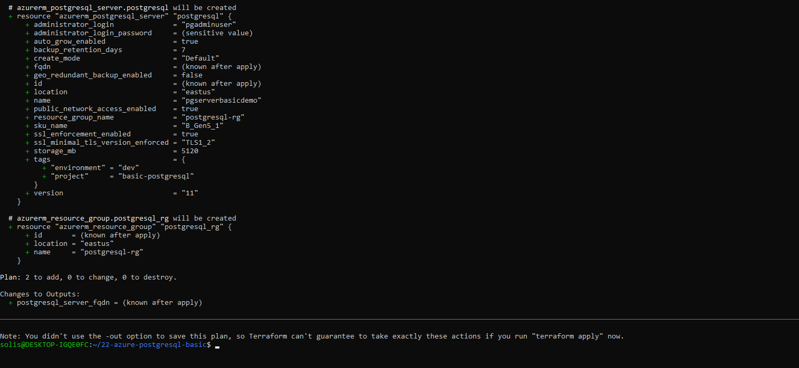

# Project 22 – Azure PostgreSQL Basic (Simulated Plan)

## Purpose
Simulate a basic PostgreSQL server deployment using Terraform with default settings. No real resources are provisioned — this validates logic and structure offline in WSL.

## What It Includes
- Terraform files to provision:
  - Azure Resource Group
  - Azure PostgreSQL Server (Basic Tier)
- Variables for customization
- Output for PostgreSQL FQDN

## Terraform Workflow
```bash
terraform init
terraform validate
terraform plan
```

## Screenshot

