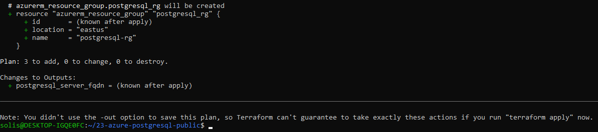

Project 23 – Azure PostgreSQL with Public Networking (Simulated Plan)

Purpose:
Simulate a PostgreSQL server deployment on Azure using Terraform, including public access via firewall rule.
This is a local simulation only — no resources are provisioned.

What It Includes:
- Azure Resource Group
- Azure PostgreSQL Server (Basic Tier)
- PostgreSQL Firewall Rule to allow public access from 0.0.0.0/0
- Terraform outputs: PostgreSQL FQDN

Terraform Workflow:
terraform init
terraform validate
terraform plan

Screenshot:

