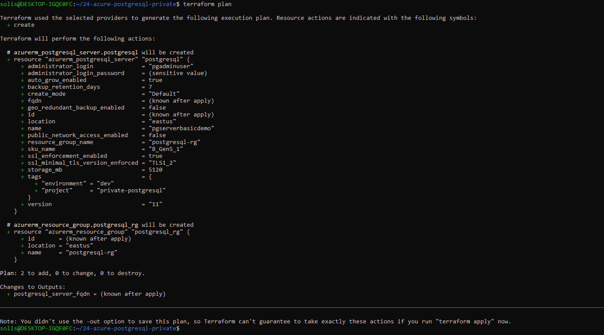

Project 24 – Azure PostgreSQL with Private Networking (Simulated Plan)

Purpose:
Simulate a PostgreSQL server deployment using Terraform where public network access is disabled. This represents a common production security posture, limiting access to internal VNETs or trusted environments.

What It Includes:
- Azure Resource Group
- Azure PostgreSQL Server (Basic Tier)
- Public network access explicitly disabled
- Terraform outputs: PostgreSQL FQDN (not accessible without private networking)

Terraform Workflow:
terraform init
terraform validate
terraform plan

Screenshot:

