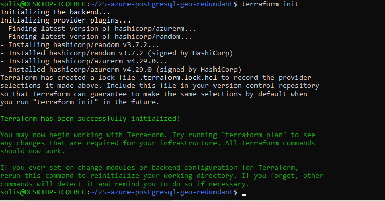

# Project 26: Azure PostgreSQL with Advanced Security (Simulated)

This project simulates deploying a secure PostgreSQL Flexible Server in Azure using Terraform. It focuses on advanced security practices by restricting public access and using VNet integration.

## Features

- 🚫 Public network access disabled
- 🌐 Integrated with a private Virtual Network and Subnet
- 🔥 Firewall rule allowing access from a single IP
- 📦 Fully simulated with `terraform plan` only
- 🧾 Outputs server name and network mode

## Terraform Resources

- `azurerm_postgresql_flexible_server`
- `azurerm_virtual_network`
- `azurerm_subnet`
- `azurerm_postgresql_flexible_server_firewall_rule`
- `azurerm_resource_group`

## Screenshot

Below is the output from `terraform plan`:

---

<<<<<<< HEAD
## 📁 Project Structure

Each project folder includes:

- `main.tf` – core infrastructure logic
- `variables.tf` – configurable inputs
- `outputs.tf` – key results returned from resources
- `provider.tf` – required providers and backend
- `README.txt` – explanation of what each project does
- `screenshots/` – embedded Terraform plan results

---

## 🗂 Projects

- [Project 22 – PostgreSQL Basic](https://github.com/ASolis2/azure-terraform-projects/blob/project-22/README.md)  
  Deploys a basic PostgreSQL Server in Azure (simulated plan)

- [Project 23 – PostgreSQL Public Access](https://github.com/ASolis2/azure-terraform-projects/blob/project-23/README.md)  
  Adds public network firewall rules to PostgreSQL (simulated plan)

- [Project 24 – PostgreSQL Private Networking](https://github.com/ASolis2/azure-terraform-projects/blob/project-24/README.md)  
  Deploys PostgreSQL server into a private subnet (no public IP)

- [Project 25 – PostgreSQL Geo-Redundant Backup](https://github.com/ASolis2/azure-terraform-projects/blob/project-25/README.md)  
  Simulates geo-redundant storage for backups (simulated only)

- [Project 26 – PostgreSQL Advanced Security](https://github.com/ASolis2/azure-terraform-projects/blob/project-26/README.md)  
  Private-only PostgreSQL server with VNet + firewall rule (simulated)

---

## 🎯 Goals

- Demonstrate clean Terraform structure and branching
- Simulate real-world Azure deployments locally for learning and practice
- Build a strong DevOps/Cloud portfolio with public GitHub documentation

---

## 🧠 Built With Learning & Job Readiness in Mind

Each project is crafted for clarity, documentation, and to showcase infrastructure knowledge to future employers or recruiters.
=======
*Built and documented with job-readiness and secure deployment practices in mind.*
>>>>>>> project-26

