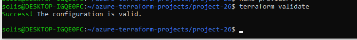

# Project 26 – Azure PostgreSQL with Advanced Security (Simulated)

This project simulates deploying an Azure PostgreSQL Flexible Server using Terraform, with basic configuration and a placeholder for advanced security monitoring (commented out). This setup is designed to validate syntax and structure only — no actual Azure deployment occurs.

---

## What This Project Includes

- Resource Group  
- Azure PostgreSQL Flexible Server  
  - Admin login & password setup  
  - Storage & backup retention  
  - Maintenance window  
  - Disabled Active Directory authentication  
- Tags for environment labeling  
- (Simulated) Diagnostic Settings (commented out to avoid API validation)  

---

## Purpose

This project helps demonstrate infrastructure-as-code for a secure PostgreSQL deployment in Azure without incurring any cloud costs. It emphasizes valid Terraform structure and usage of real-world resource blocks in simulation mode.

---

## Screenshot

Terraform validate output to confirm working syntax:



---

## Notes

> ⚠️ Azure authentication is not required for this project. The provider block uses only:
```hcl
provider "azurerm" {
  features {}
}
```

> This is intended for GitHub portfolio purposes and `terraform validate` is used instead of `terraform plan`.

