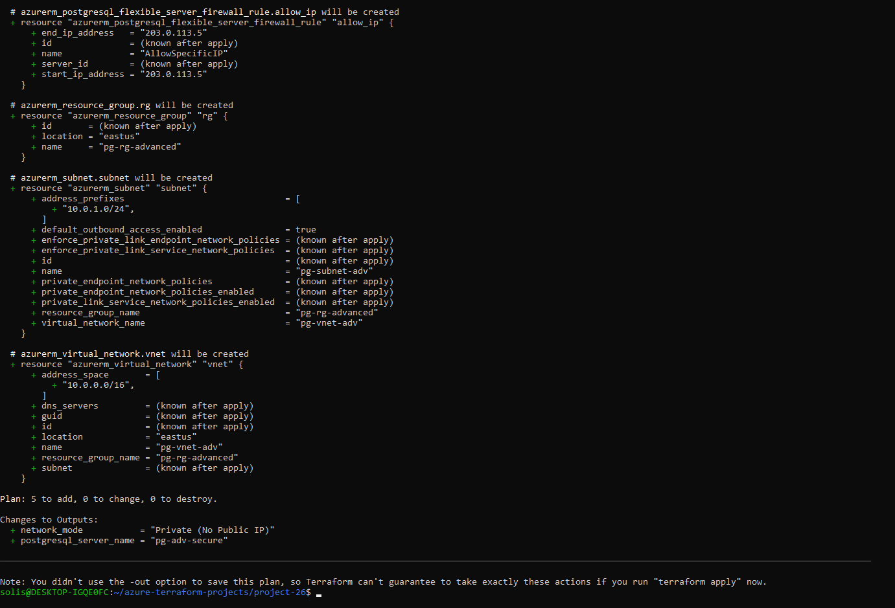

## 🔐 Key Features

- No public access (`public_network_access_enabled = false`)
- VNet and subnet integration
- Single IP firewall rule using `azurerm_postgresql_flexible_server_firewall_rule`
- Simulated only using `terraform plan`

---

## 📸 Screenshot

Below is the output from `terraform plan`:

---

*Built and documented with job-readiness and secure deployment practices in mind.*

