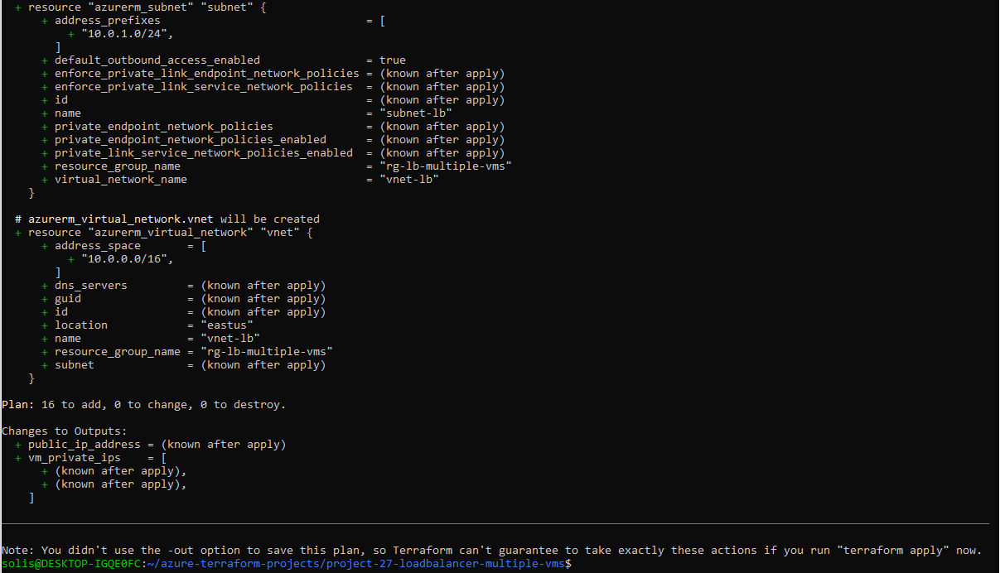

# Project 27 - Azure Load Balancer with Multiple VMs

## Overview

This project demonstrates how to deploy a public-facing Azure Load Balancer that distributes traffic across two backend Linux virtual machines (VMs). It includes a virtual network, subnet, NSG, public IP, load balancer, backend pool, health probe, HTTP rule, availability set, and two VMs.

All infrastructure is managed using Terraform.

---

## What This Project Includes

- Resource Group
- Virtual Network and Subnet
- Network Security Group allowing HTTP
- Public IP Address
- Azure Standard Load Balancer
  - Backend Address Pool
  - Health Probe (HTTP)
  - Load Balancing Rule (Port 80)
- Availability Set (for high availability)
- 2 Linux Virtual Machines in backend pool
- NIC-to-pool association using:
  `azurerm_network_interface_backend_address_pool_association`

---

## Purpose

This architecture is commonly used to:
- Provide high availability and redundancy
- Load balance HTTP traffic between VMs
- Simulate production-like scenarios with multiple servers

---

## Terraform Files

- `main.tf`: Infrastructure definitions
- `variables.tf`: Input variables
- `outputs.tf`: Output values (e.g., public IP, VM private IPs)
- `provider.tf`: Provider configuration
- `.gitignore`: Prevents `.terraform/` and state files from being committed
- `/screenshots/terraform-plan.png`: Screenshot of Terraform plan

---

## Screenshot



---

## Usage

Initialize and validate your configuration (simulated):
```bash
terraform init
terraform plan
```

Push your work to GitHub using a branch:
```bash
git checkout -b project-27-loadbalancer-multiple-vms
git add .
git commit -m "Project 27 - Load Balancer with Multiple VMs"
git push --set-upstream origin project-27-loadbalancer-multiple-vms
```

