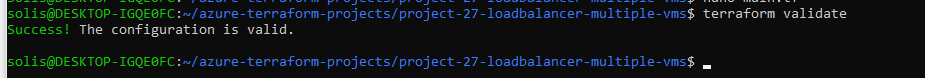

# Project 27 – Azure Load Balancer with Multiple VMs (Simulated)

This project demonstrates how to deploy a public-facing Azure Load Balancer that distributes traffic across two backend Linux virtual machines (VMs). It includes a virtual network, subnet, NSG, public IP, load balancer, backend pool, health probe, HTTP rule, and two simulated VMs.

> ⚠️ This is a **simulated project**. No actual Azure resources are created or billed.

---

## What This Project Includes

- Resource Group
- Virtual Network and Subnet
- Network Security Group allowing HTTP
- Public IP Address
- Azure Standard Load Balancer
  - Backend Address Pool
  - Health Probe (HTTP)
  - Load Balancing Rule (Port 80)
- 2 Simulated Linux Virtual Machines
- Availability Set (optional for redundancy)
- NIC-to-pool association using `azurerm_network_interface_backend_address_pool_association`

---

## Purpose

This architecture is commonly used to:

- Provide high availability and redundancy
- Distribute web traffic across multiple VMs
- Enable horizontal scalability

---

## Screenshot

Validation output to confirm working syntax:



---

## Notes

> Azure authentication is not required. This project uses only:
```hcl
provider "azurerm" {
  features {}
}
```

> The goal is to simulate the architecture and validate Terraform syntax using `terraform validate` instead of `terraform plan`.

